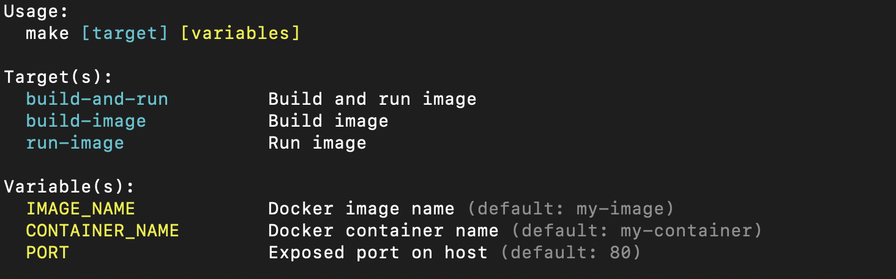
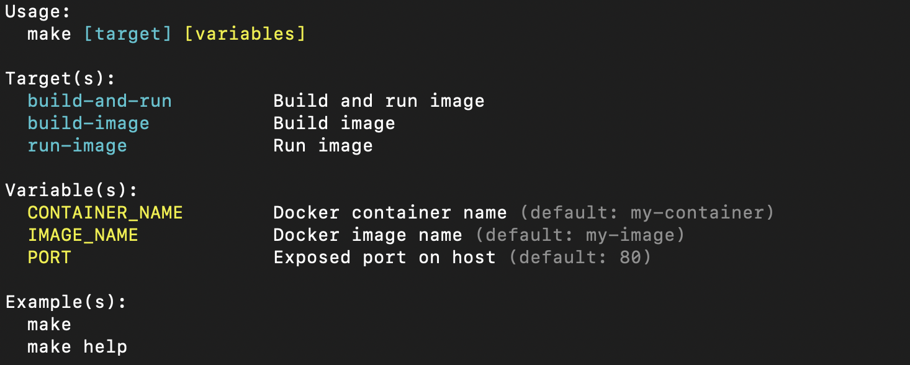

# mhelp
A CLI tool written in Go that prints a help doc of your Makefile.

Inspired from the [article](https://medium.com/@vildmedpap/make-your-makefile-user-friendly-create-a-custom-make-help-target-88c9ef130879) by *Sebastian Steenssøe*.

# How
### How do I use it?
The usage is almost identical to the bash script from the article:
1) Download the release binaries from this repo (or build them yourself).
2) Create a `scripts` folder at the root of your repo and place the downloaded binaries there.
3) Lastly, assuming your Makefile is found at your repo's root, add this to your Makefile:
```Makefile
.DEFAULT_GOAL := help

help:  ## Show help and exit.
    @./scripts/<name_of_binary> -filepath <makefile_filepath>
```

You are now ready to show the output of the `help` target by running `make` or `make help`. If you need more usage notes, running the tool with the help flag `<name_of_binary> [-h/-help]` will generate the usage docs:
```text
Usage of ./scripts/help_darwin_arm64:
  -filepath string
    	The filepath of your Makefile. (default "./Makefile")
  -sort
    	Sort variable and target names alphabetically. (default true)
```

### How does it work?
The tool captures and processes any line that contains a comment denoted by the `##` sequence and organizing them into the sections `Target(s)` and `Variable(s)`.

Comments denoted by `#` will be ignored. Comments denoted by `##` but not placed on the same line as a variable or target will also be ignored. Any line that contains more than 2 `#` in a row  will have anything past the second `#` treated as documentation.

For example, these are the outputs you can expect for the given Makefiles:

#### Example Makefile 1:
```Makefile
IMAGE_NAME := my-image## Docker image name
CONTAINER_NAME := my-container## Docker container name
PORT := 80## Exposed port on host

build-and-run: build-image run-image## Build and run image

build-image:## Build image
    @docker build -t ${IMAGE_NAME}:latest .

run-image:## Run image
    @docker run --name ${CONTAINER_NAME} -p ${PORT}:5000 ${IMAGE_NAME}:latest
```
[](docs/images/test_makefile1.png)

#### Example Makefile 2:
```Makefile
# This is a comment that will be ignored.
# This is a comment that will be ignored.
# This is a comment that will be ignored.
## This is also a comment that will be ignored.
## This is also a comment that will be ignored.
## This is also a comment that will be ignored.
IMAGE_NAME := my-image## Docker image name
CONTAINER_NAME := my-container## Docker container name
PORT := 80## Exposed port on host
## This is also a comment that will be ignored.
## This is also a comment that will be ignored.
## This is also a comment that will be ignored.
# This is a comment that will be ignored.
# This is a comment that will be ignored.
# This is a comment that will be ignored.

# Don't mind me.
build-and-run: build-image run-image  ## Build and run image
# Don't mind if I do.

## Hello!
build-image:  ## Build image
    @docker build -t ${IMAGE_NAME}:latest .
## Goodbye!

### I hope this tool is working out for you!
run-image:  ## Run image
    @docker run --name ${CONTAINER_NAME} -p ${PORT}:5000 ${IMAGE_NAME}:latest
```
[](docs/images/test_makefile2.png)

And if for whatever reason you decide to use Makefiles that are `50.000 lines` long, the tool can process that too in under `1 second`.


# Why?
It has been incredibly convenient to have a useful `help` target in a Makefile, but some improvements were needed for my use cases.

Some Makefiles need more flexibility. For example, I'd like to have an arbitrary number of spaces between the target/variable and the documentation. The other need is working with larger Makefiles.

The Bash script in the article works perfectly fine and is quite snappy (less than `~0.5 seconds`) for Makefiles with fewer than `50 lines`. But it can take `~10 seconds` to complete for Makefiles with `~200 lines`. This is due to the script's need for regular expressions to work. As such, I decided to make a bare bones and snappy CLI tool using Go.
